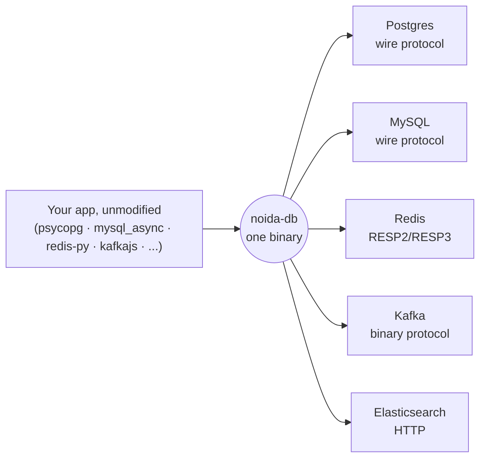

<div align="center">

# noida-db

**One tiny binary that speaks Postgres, MySQL, Redis, Kafka, and Elasticsearch —**
**so your existing drivers, ORMs, and CLIs point at it, unchanged.**

[](https://github.com/its-banana-coder/noida-db/actions/workflows/ci.yml)
[](https://github.com/its-banana-coder/noida-db/actions/workflows/real-apps.yml)
[](LICENSE)


No Docker Compose stack idling at 2.5–4GB. No five heavy servers to boot
before `npm run dev` works. One Rust binary, real wire protocols, your
tools don't know the difference.

</div>

```sh
npm install -g noida-db             # or: pip install noida-db / brew install its-banana-coder/noida-db/noida-db
noida-db start                      # every built-in service, default ports
noida-db start --only redis,postgres
noida-db start --redis-port 6380
```

See `noida-db help` for the full option list, or jump to
**[Installing](#installing)** for every install option.

---

## At a glance

| | |
|---|---|
| 🚀 **4 real applications**, end to end | Gitea, Miniflux, WordPress, Faust — unmodified, real schemas, real workflows, all green in CI |
| 📦 **34 real client libraries & ORMs** verified | psycopg, SQLAlchemy, Django, redis-py, ioredis, kafkajs, Sequelize, GORM, JDBC, and more |
| 🪶 **~7MB binary, ~5MB idle** with all five services running, ~15MB under real app load | vs. the multi-gigabyte real stack |
| ⚡ **Sub-100µs** reads on Redis/Elasticsearch paths | measured, not claimed — see [Benchmarks](#benchmarks) |
| 💾 **On-disk persistence** for Postgres, Redis, Elasticsearch, MySQL, Kafka | survives a clean restart |
| 🔍 **Every gap tracked, not hidden** | [docs/LIMITATIONS.md](docs/LIMITATIONS.md) — updated by every PR |

## Why noida-db

Real Postgres/Redis/Kafka/Elasticsearch are built for production:
replicated, clustered, tuned, heavy. None of that matters when you're
writing and testing an app on a laptop. noida-db implements exactly the
part a developer actually touches — the commands and APIs real clients
send — and skips the rest.



**"100% compatible" means the compatibility test suite passes 100%:**
real client libraries, ORMs and CLIs run against noida-db unmodified,
their results compared byte-for-byte against the real server. See
[COMPATIBILITY.md](COMPATIBILITY.md) for the footprint targets and the
rules every service follows.

## Tested against real applications

Not a synthetic client — actual, unmodified open-source applications
running against noida-db as their real database, in their own CI
workflow (`real-apps.yml`):

| App | What it exercises |
|---|---|
| ✅ [Gitea](https://about.gitea.com/) (Postgres + Redis) | Full ~115-table production schema via xorm; creating a repo, `git clone`/`push` over HTTP, issues, and a full PR workflow (branch → PR → merge) via the REST API |
| ✅ [Miniflux](https://miniflux.app/) (Postgres) | 134-migration schema (including a real cursor); adding an RSS feed, parsing entries, full-text search over titles/content |
| ✅ [Faust](https://faust.readthedocs.io/) (Kafka) | Python streaming pipeline on `aiokafka`; dynamic topics, concurrent consumer-group rebalances, live record streaming |
| ✅ [WordPress](https://wordpress.org/) (MySQL) | Real WP-CLI core install (~12 tables, no ORM), creating a post + comment, round-tripped through the real REST API |

RAM while running these: as low as **2MB idle**, peaking at **15MB**
during the heaviest activity, settling in the 5–15MB range at rest —
well under the [footprint targets](COMPATIBILITY.md#footprint-targets).

Next up: Ghost and Strapi (MySQL), Wagtail/django-cms (Postgres), Forem
(Postgres + Redis + Elasticsearch), and a Spring Kafka application.

## Compatibility

| Service | Real clients/ORMs | Real apps | Protocol coverage |
|---|---|---|---|
| **Postgres** | 14 — psycopg, SQLAlchemy, Django, asyncpg, Alembic, node-postgres, Knex, TypeORM, Sequelize, pgx, GORM, sqlx, Npgsql, JDBC | ✅ Gitea · ✅ Miniflux | DDL/DML, full-text search, range types, materialized views, cursors, catalogs |
| **MySQL** | `mysql_async` in CI, plus differential suites against a real MySQL server; also verified with pymysql, SQLAlchemy, Django (migrations + ORM), Node's mysql2, Go `database/sql` + GORM, JDBC Connector/J and the `mysql` CLI | ✅ WordPress | Keys and upserts, `ALTER TABLE`, transactions and savepoints (incl. `autocommit=0`), prepared statements, joins, aggregates, JSON/ENUM, `information_schema` |
| **Redis** | 12 — redis-py, node-redis, ioredis, go-redis, Jedis, Lettuce, Spring Data Redis, Redisson, BullMQ, RQ, Celery, Sidekiq | — (next: Sidekiq app) | 217 / 242 Redis 7.2 commands — [`src/redis/README.md`](src/redis/README.md) |
| **Kafka** | 5 — kafkajs, confluent-kafka-python, kafka-go, Java kafka-clients, Spring Kafka | ✅ Faust | Consumer groups, real transactional isolation (`read_committed`, producer fencing), cluster/config admin |
| **Elasticsearch** | 2 — official Java and Python clients | — (next: Django + django-elasticsearch-dsl) | `match`/`bool`/`range`/aggregations with real BM25 scoring, verified against a real ES 8.15 node |

Every row's remaining gaps are tracked precisely, not hand-waved — see
[docs/LIMITATIONS.md](docs/LIMITATIONS.md) for the exact list per
service, and [docs/specs/](docs/specs/) for what's planned next. Each
service is its own Cargo feature (on by default) and can be switched off
at build time or runtime (`--only`) — a disabled service allocates
nothing.

<details>
<summary><strong>What's intentionally out of scope</strong></summary>

<br>

Production concerns that don't apply to a local dev tool: replication,
clustering, sharding, multi-user security/ACLs/TLS, query profiling, and
real clustering behavior of any kind. See
[COMPATIBILITY.md](COMPATIBILITY.md) for the full rule set.

</details>

## Benchmarks

[`benchmarks/noidadb_bench.py`](benchmarks/noidadb_bench.py) measures
the database engine itself — throughput, latency, CPU time, RSS — across
dataset size, record size, and client concurrency, using each service's
real wire protocol. Not a production-traffic simulator: no users, QPS
targets or business workflows are fabricated.

**At 1,000 records, 100-byte values, 1 client (p50 latency):**

| Service | insert | read | update | delete | scan |
|---|---:|---:|---:|---:|---:|
| Redis | 70µs | 66µs | 66µs | 128µs | 296µs |
| Elasticsearch | 236µs | 231µs | 240µs | 504µs | 231µs |
| Postgres | 508µs | 413µs | 832µs | 1.0ms | 3.4ms |
| MySQL | 58µs | 544µs | 114µs | 64µs | 3.7ms |

Redis and Elasticsearch do an ID-keyed lookup — latency stays flat as
the dataset grows from 1K to 10K records. Postgres and MySQL have no
real indexing yet (a deliberate "simple over performant" tradeoff, not a
bug), so a lookup is a linear scan and cost grows with table size
(~7–9× over that same range). Full scaling curves, concurrency behavior,
and methodology: [docs/BENCHMARKING.md](docs/BENCHMARKING.md).

<details>
<summary><strong>A real bug these exact numbers caught</strong></summary>

<br>

MySQL's `read`/`scan` were originally measured in the tens of
milliseconds — a ~1000× gap from Redis for no algorithmic reason.
Postgres's server already disabled Nagle's algorithm (`TCP_NODELAY`) on
every connection; MySQL's never did, so its two-syscall-per-packet wire
protocol stalled on the client's ~40ms delayed-ACK timer on every single
response. Fixed, and applied to every other service that was missing it
too (Kafka, Elasticsearch, RabbitMQ, MongoDB, ClickHouse).

</details>

## Installing

Prebuilt binaries for Linux (x64, arm64), macOS (Intel, Apple Silicon)
and Windows (x64):

```sh
# npm
npm install -g noida-db        # or run it once: npx noida-db start

# pip
pip install noida-db

# Homebrew
brew install its-banana-coder/noida-db/noida-db

# Docker (amd64 + arm64)
docker run -p 5432:5432 -p 3306:3306 -p 6379:6379 -p 9092:9092 -p 9200:9200 ghcr.io/its-banana-coder/noida-db

# crates.io (builds from source)
cargo install noida-db --all-features
```

Or download an archive from
[GitHub Releases](https://github.com/its-banana-coder/noida-db/releases).

Details for each channel: [docs/PACKAGING.md](docs/PACKAGING.md).

## Use it in CI

One step replaces the five service containers:

```yaml
- uses: its-banana-coder/noida-db@main
  with:
    version: "0.1.3"                                       # optional, default: latest
    services: postgres,mysql,redis,kafka,elasticsearch     # optional, default: all five
```

It starts noida-db on the standard ports and waits until every port accepts
connections. Or without the action: `npx noida-db start &`.

Measured on GitHub Actions with the same integration tests
([`examples/ci-demo`](examples/ci-demo), 3 runs each):

| | Official service containers | noida-db |
|---|---:|---:|
| Databases ready | 74–76 s | 4–6 s (including the npm download) |
| Tests | 5–6 s | ~1 s |
| Whole job | ~90 s | ~14–23 s |

## What's next

- **Wider benchmark coverage** — a native long-lived Kafka client for
  producer/fetch numbers, plus index and persistence-cost benchmarks.
- **More real applications** — see [the table above](#tested-against-real-applications).

## Documentation

- [COMPATIBILITY.md](COMPATIBILITY.md) — the compatibility promise, footprint
  targets, and the rules every service follows.
- [docs/LIMITATIONS.md](docs/LIMITATIONS.md) — what doesn't work, updated by
  every PR.
- [docs/BENCHMARKING.md](docs/BENCHMARKING.md) — benchmark methodology and
  how to reproduce.
- [docs/SERVICE_GUIDE.md](docs/SERVICE_GUIDE.md) — how a service is built,
  for anyone adding or extending one.
- [docs/specs/](docs/specs/) — a detailed spec per service, written before
  implementation and kept as the design reference afterward.
- [THIRD_PARTY.md](THIRD_PARTY.md) — code ported from upstream projects and
  its license.

## Building and testing

```sh
cargo build --release                       # default features: redis + postgres
cargo build --release --all-features        # every service, including MySQL/Kafka/Elasticsearch
cargo build --no-default-features --features redis
cargo test --all-features
scripts/check-size.sh                       # binary size budget (40MB)
```

Each service has three layers of tests: engine-level tests with exact
replies and error text, differential tests against the real server
(`NOIDA_<SERVICE>_REF=host:port`), and real-client tests under
`tests/clients/` that install their own dependencies and run with one
command. CI runs all of it against real reference servers.

Real, unmodified *applications* live under `tests/apps/` — the same
one-command-per-app convention, run as their own CI workflow since each
takes minutes and hits real networks for pinned, checksum-verified
releases.

## License

MIT — see [LICENSE](LICENSE).
